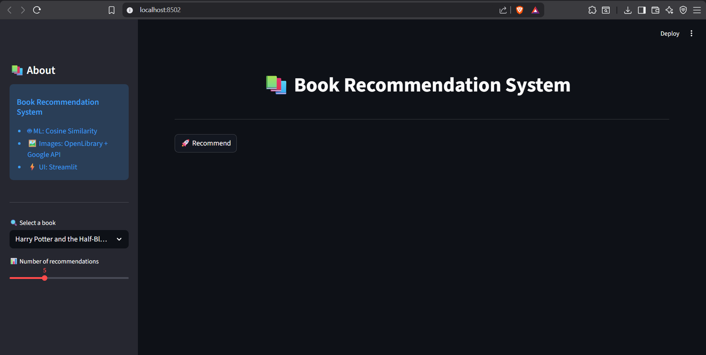
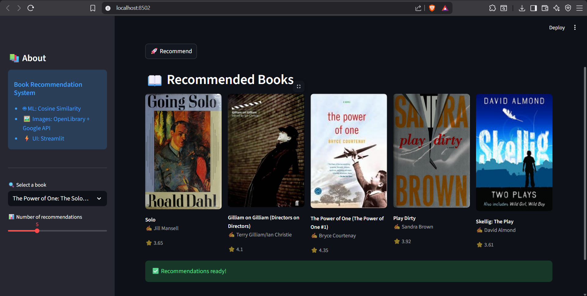
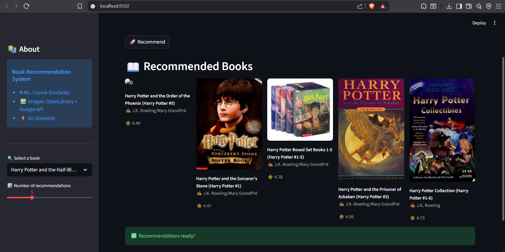

# 📚 Book Recommendation System

🚀 A Machine Learning-based Book Recommendation System that suggests similar books using **cosine similarity**.
Built with **Python, Pandas, and Streamlit**, and deployed as a live web app.

---

## 🌐 Live Demo

👉 https://book-recommendation-system-ml-mcgkyzbqmt4uchtdpw9qhm.streamlit.app/

---

## ✨ Features

* 🔍 Select a book from dropdown
* 🤖 ML-based recommendations (Cosine Similarity)
* 📖 Top N similar books suggestion
* 🖼️ Dynamic book cover images (OpenLibrary + Google API)
* ⚡ Fast recommendations using precomputed similarity
* 🎨 Clean and responsive UI with Streamlit

---

## 🛠️ Tech Stack

* **Python**
* **Pandas**
* **Scikit-learn**
* **Streamlit**
* **APIs** (OpenLibrary, Google Books)

---

## 🧠 How It Works

1. Dataset of books is processed using Pandas
2. Text/vector features are created
3. Cosine similarity matrix is computed
4. User selects a book
5. System finds most similar books based on similarity score
6. Displays top recommendations with images

---

## 📸 Screenshots

### 🏠 Home Page





### 📖 Recommendations


### 🎯 Output


---

## ⚙️ Installation

```bash
git clone https://github.com/maniac-24/Book-Recommendation-System-ML
cd Book-Recommendation-System-ML
pip install -r requirements.txt
streamlit run app.py
```

---

## 📂 Project Structure

```
├── app.py
├── train_model.py
├── books.csv
├── requirements.txt
├── images/
├── README.md
```

---

## 🚀 Future Improvements

* ⭐ Add user ratings & reviews
* 🔍 Smart search bar (autocomplete)
* 📊 Genre-based filtering
* ❤️ Save favorite books
* 🎨 Netflix-style UI

---

## 👨‍💻 Author

**Prashanth Madival**

---

## ⭐ Support

If you like this project, give it a ⭐ on GitHub!
