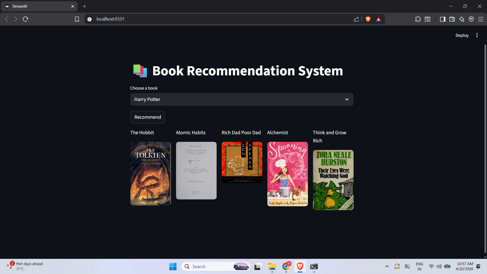
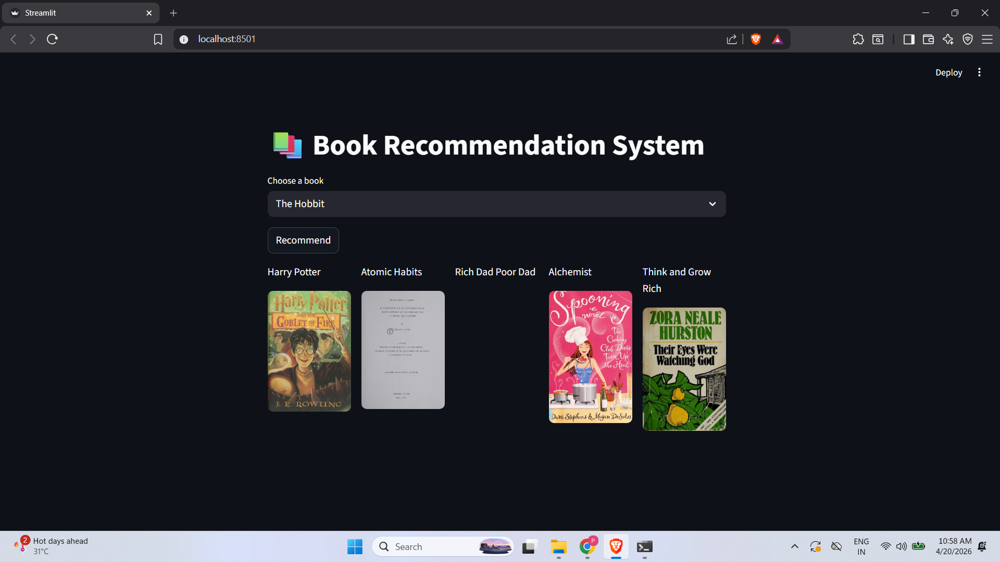

# Book Recommendation System

## Overview
This project is a machine learning-based book recommendation system that suggests similar books based on user selection.

---

## Technologies Used
- Python
- Pandas
- Streamlit
- Machine Learning (Similarity Matrix)

---

## Features
- Select a book from dropdown
- Get top 5 similar books
- Displays book titles and images
- Fast recommendation using precomputed similarity

---

## How It Works
1. Dataset of books is processed
2. Similarity matrix is created
3. User selects a book
4. System finds similar books using similarity scores
5. Displays recommendations

---

## Screenshots

### Home Page

### Recommendation

### Output

---

## How It Works
- Dataset is processed using Pandas
- Similarity matrix is created using cosine similarity
- When a user selects a book:
  - System finds similar books
  - Returns top 5 recommendations

---

## Run Project

pip install -r requirements.txt
streamlit run app.py

---

## Run Locally

git clone https://github.com/maniac-24/Book-Recommendation-System-ML
cd Book-Recommendation-System-ML
pip install -r requirements.txt
streamlit run app.py
